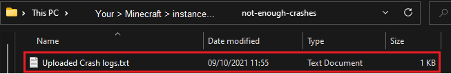
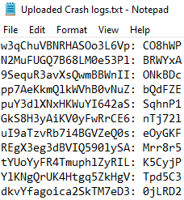

# What is the crash code of my crash?
If you've recently created your crash, the code will be available when you click the  button. You can then freely delete or store the code for later.   
However, if the  window demands a code and you haven't saved it, here's what you can do:
## I uploaded through the Not Enough Crashes screen
**The codes for your crashes are stored in your Minecraft instance directory under `not-enough-crashes/Uploaded Crash logs.txt`**.  
  
From there you can see the codes of crash logs you have uploaded:

The left side is **the ID of a crash** and the right side is **the code** of said crash.

The ID of the crash you are viewing is **the path of the URL after crashy.net**:  

So search for the ID of the crash you are viewing, and on the right side you will see the code you need. 

## I uploaded through the Crashy.net home page

If you haven't stored the code of the crash you are uploaded and you must delete it, the best you can do is contact the author of Crashy (Fudge) directly for it to be removed.
