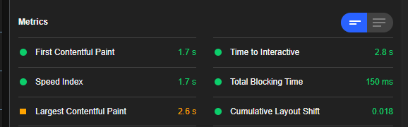

# What is the crash code of my crash?
If you've recently created your crash, the code will be available when you click the  button. You can then freely delete or store the code for later.   
However, if the  window demands a code and you haven't saved it, here's what you can do:
## I uploaded through the Not Enough Crashes screen
**The codes for your crashes are stored in your Minecraft instance directory under `not-enough-crashes/Uploaded Crash logs.txt`**.  

//TODO: pic of contents, pic of url explaining how to go from url to code.
